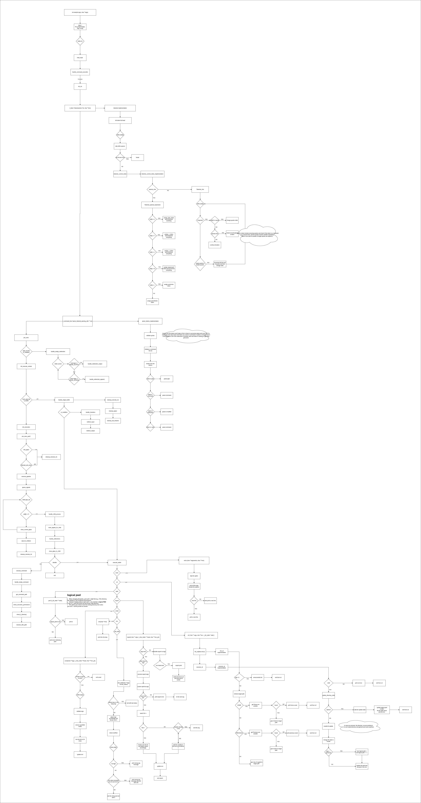

# minishell

A Unix shell built from scratch in C, supporting pipelines, redirections, and
environment management.

## Features

- Runs external commands by resolving them through PATH
- Pipes output between commands with `|`
- Handles input/output redirections including `>`, `<`, `>>`, and heredoc `<<`
- Expands environment variables and manages them with `export` and `unset`
- Built-in commands: `cd`, `echo`, `pwd`, `env`, `export`, `unset`, `exit`
- Handles `Ctrl-C` and `Ctrl-\` signals the way a real shell would

## Getting Started

```bash
git clone https://github.com/tohmeh/minishell.git
cd minishell && make
./minishell
```

## Project Structure

```
src/
  main/          entry point and shell loop
  tokenization/  splits raw input into tokens, handling quotes and spaces
  parsing/       builds token sequences into executable command structures
  execution/     forks processes, sets up pipes, and manages redirections
  build_in/      implementations of all built-in commands
  utils/         shared helpers
LIBFT/           custom C utility library used throughout the project
includes/        shared header files
```


